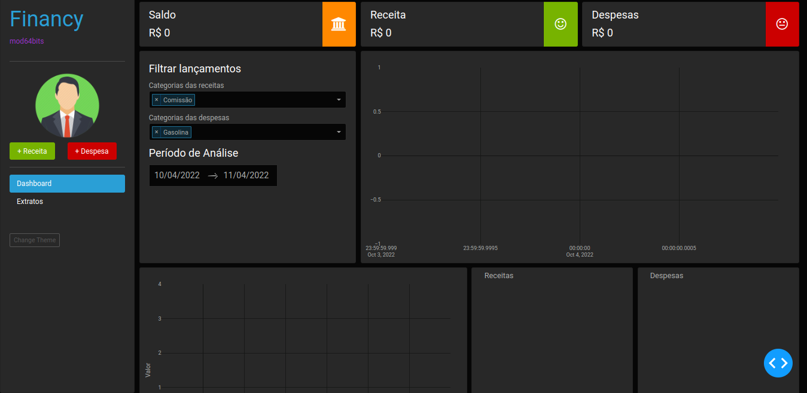
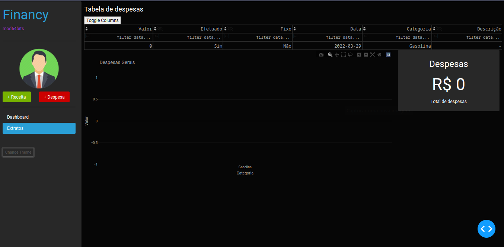

# ModFinancy

Projeto de um app web de análise financeira pessoal usando apenas Python com base de dados no computador do usuário.

## 🔧 Funções

- Coletar e armazenar receitas do usuário
- Coletar e armazenar despesas do usuário
- Dispor de uma página de Dashboards para análise visual sobre os dados fornecidos
- Dispor de uma página de extratos, para que possa visualizar os dados de forma mais minuciosa e completa

## 💻 Projeto
Projeto Não Finalizado, mas funcional para um único usuário

## 👨‍💻 Tecnologias Utilizadas

Utilizando apenas **PYTHON** e as bibliotecas:
> - Dash
> - Dash-Core-Components
> - Dash HTML
> - Dash Bootstrap
> - Plotly
> - Pandas

## 📜 Conteúdo
Para Mais Informações acesse:

✉ mod64bits@gmail.com

